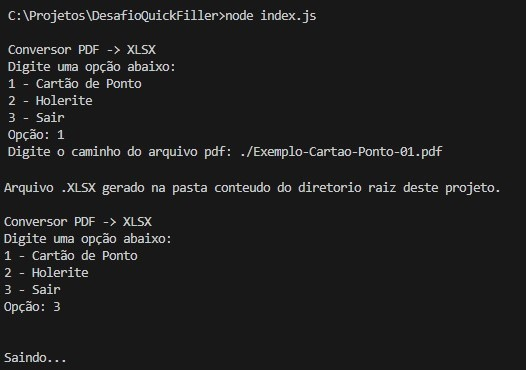

# Conversor PDF → XLSX

Este projeto tem como objetivo converter arquivos **PDF** (como cartões de ponto e holerites) em planilhas **XLSX**.

---

## Solução Aplicada
* Menu interativo em CLI para direcionar o fluxo de extração e exportação.
* Extração do texto do PDF com a biblioteca **`pdf-parse-new`**.
* Tratamento e formatação dos dados utilizando funções JavaScript e Expressões Regulares (regex).
* Geração do arquivo **`.xlsx`** com a biblioteca **`xlsx`**.

### Fluxo do processo
1. Usuário seleciona o tipo de documento no menu.
2. O sistema extrai o texto bruto do PDF.
3. As linhas são filtradas e estruturadas conforme o layout do documento.
4. Os registros são exportados para uma planilha Ecxel.
	
---

## Instalação

### 1. Clone o repositório
```bash
git clone https://github.com/MatheusGomes00/desafio-programador.git
cd DesafioQuickFiller
````

### 2. Instale as dependências

```bash
npm install
```

### 3. Pré-requisitos

Certifique-se de que:

* Você possui **Node.js v22** ou superior instalado.
* Existe um diretório chamado **`conteudo/`** na raiz do projeto (usado para armazenar os arquivos `.xlsx` gerados).

---

## Como Executar

Na raiz do projeto, execute:

```bash
node index.js
```

O menu interativo será exibido com as seguintes opções:

```
1 - Cartão de Ponto
2 - Holerite
3 - Sair
```

Após selecionar a opção desejada, informe o **caminho completo** do arquivo PDF.

Os arquivos gerados serão salvos automaticamente na pasta `conteudo/` com os nomes:

* `Cartao-Ponto-01.xlsx` → para cartões de ponto
* `Holerite-01.xlsx` → para holerites

---

## Dependências

### Dependências Principais

| Pacote            | Versão  | Descrição                         |
| ----------------- | ------- | --------------------------------- |
| **pdf-parse-new** | ^1.4.1  | Extração de texto de arquivos PDF |
| **prompt-sync**   | ^4.2.0  | Entrada de dados via terminal     |
| **xlsx**          | ^0.18.5 | Geração de planilhas Excel        |

### Dependências de Desenvolvimento

| Pacote   | Versão  | Descrição                    |
| -------- | ------- | ---------------------------- |
| **jest** | ^30.2.0 | Execução de testes unitários |

Para instalar todas as dependências:

```bash
npm install
```

Para executar os testes:

```bash
npm run test
```

---

## Exemplos de Uso



## Observações Importantes

* Espera-se que os arquivos **.pdf** tenham a mesma estrutura do exemplo base fornecido.
* Arquivos **.pdf** que não possuem texto selecionável não são processados. Não foi implementada funcionalidade OCR com **Tesseract**.
* O diretório **`conteudo/`** deve existir na raiz do projeto.
* Forneça sempre o **caminho completo** do arquivo PDF. Para facilitar você pode salvar o arquivo na raiz do projeto, passando apenas `./Nome-do-arquivo.pdf`
* O programa **valida a extensão e a existência** do arquivo antes de processá-lo.
* Para sair/encerrar a aplicação, selecione a opção **3** no menu principal.

---
